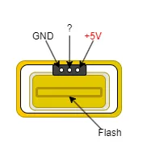
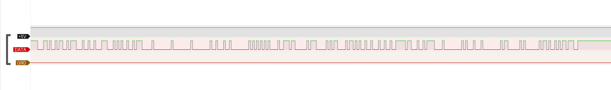

# braun_silk_expert_pro_5
Waveform of Braun Silk expert Pro5

# Environment
The software used is [Sigrok](https://sigrok.org/wiki/Main_Page) and a device is a cheap logic analyzer (24 MHz) made in China on Amazon.

# Pin Assignment(Could be a mistake)
  

# Waveform
bandwidth: 24 MHz

- **[standby.sr](standby.sr)**: Silk Expert is ready to flash, "SensoAdapt" is not lit.
- **[not_irradiable.sr](not_irradiable.sr)**: Silk Expert will detect that the skin color is not conform.
- **[irradiable.sr](irradiable.sr)**: Silk Expert is irradiable, "SensoAdapt" is lit.

